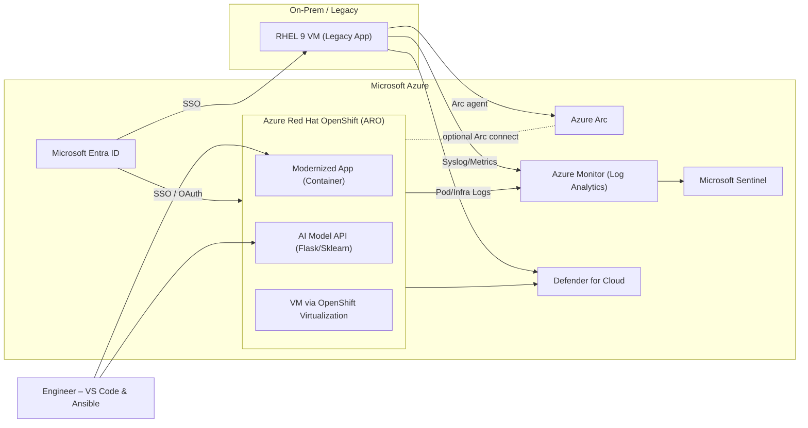
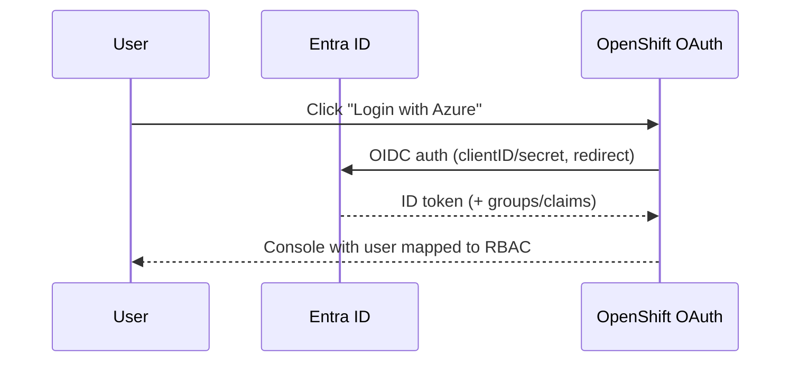

# Student Guide – *Migrate to Innovate: Building an AI‑Ready Future with Red Hat and Microsoft*

This hands-off lab shows how to **migrate**, **modernize**, and **innovate with AI** on Azure using **RHEL**, **Azure Red Hat OpenShift (ARO)**, **OpenShift Virtualization**, **Red Hat AI on Azure concepts**, **Ansible**, **VS Code**, **Azure Arc**, **Azure Monitor**, **Microsoft Defender for Cloud / Sentinel**, and **Microsoft Entra ID (Azure AD)**.

---

## Architecture



---

## 45‑Minute Agenda

```mermaid
gantt
    dateFormat  mm
    title 45-Minute Demo Timeline
    section Foundation
    Context & Goals             :a1, 01, 5m
    Identity & Security (Entra) :a2, 06, 4m
    section Build
    Provision RHEL + ARO        :b1, 10, 12m
    Arc (Servers/K8s)           :b2, 22, 4m
    section Modernize & Innovate
    Ansible on RHEL             :c1, 26, 4m
    Deploy AI Model to ARO      :c2, 30, 8m
    OpenShift Virtualization    :c3, 38, 4m
    section Operate
    Monitor/Defender/Sentinel   :d1, 42, 3m
```



---

## What You’ll Do

1. **Provision** a RHEL VM and an **ARO** cluster (managed OpenShift).
2. **Secure** with **Entra ID** SSO for ARO and optional AAD login to VMs.
3. **Automate** VM config with **Ansible**.
4. **Deploy AI**: Flask + scikit‑learn model API on OpenShift; live inference.
5. **Run VMs on OpenShift** using **OpenShift Virtualization** for “brownfield” workloads.
6. **Observe & Protect** with **Azure Monitor**, **Defender**, and **Sentinel**.
7. **(Optional)** **Azure Arc** for consistent, hybrid management and GitOps.

> **Performance choices**: Scripts default to moderate sizes. Increase `WORKER_SIZE` / use GPU nodes for high‑perf AI; choose smaller for demo/cost‑saving.

---

## Running the Scripts

1. Open a terminal, authenticate to Azure, and clone/extract this package.
2. Review `scripts/00_env.sh` and set your values (region, names, sizes).
3. Execute scripts in order. When prompted for `oc login`, use the kubeadmin from `outputs/aro-credentials.txt` created by `04_aro_cluster.sh`.
4. Deploy the AI service with `08_ocp_ai_deploy.sh`. The script prints the route URL and a sample `curl` command to run inference.
5. (Optional) Enable OpenShift Virtualization with `09_openshift_virtualization.sh` and create a sample VM.
6. Onboard logs to **Log Analytics** with `10_monitoring.sh` and turn on **Defender/Sentinel** with `11_defender_sentinel.sh`.

---

## Entra ID Integration (ARO OAuth)

- The `06_aad_on_ocp.sh` script:
  - Reads the OpenShift **oauth route host**.
  - Creates an **App Registration** in Entra ID (Azure AD) with the correct redirect URI.
  - Creates the client secret and stores it as a Secret in `openshift-config`.
  - Applies an **OAuth** configuration referencing your tenant and client ID/secret.
- After rollout, the OpenShift console shows **“Log in with Azure”**. Assign cluster roles to AAD users/groups per your RBAC model.



---

## AI Service – Test Inference

After `08_ocp_ai_deploy.sh`, run:
```bash
# Example input features for Iris (setosa-like)
curl -s -X POST -H "Content-Type: application/json" \
  -d '{"features": [5.1, 3.5, 1.4, 0.2]}' \
  http://$ROUTE/predict
```

Expect a JSON response like `{"prediction":"setosa"}`.

---

## Cleanup

To avoid charges, delete everything when done:
```bash
./scripts/12_cleanup.sh
```

---

## Notes

- **ARO Create** can take ~30–45 minutes; run earlier and present after it’s ready.
- **OpenShift Virtualization** requires sufficiently large worker nodes (e.g., D8s_v5).
- The monitoring script uses the **Log Analytics agent** for simplicity; switch to AMA/DCR for production.
- For **high‑performance AI**, consider GPU workers and higher replica counts.
- For script 03_rehl_vm.sh copy ypur keys to local machine for use later

```bash
  cp -v ~/.ssh/* /mnt/yourdrive/yourfolderpath/
```
  
